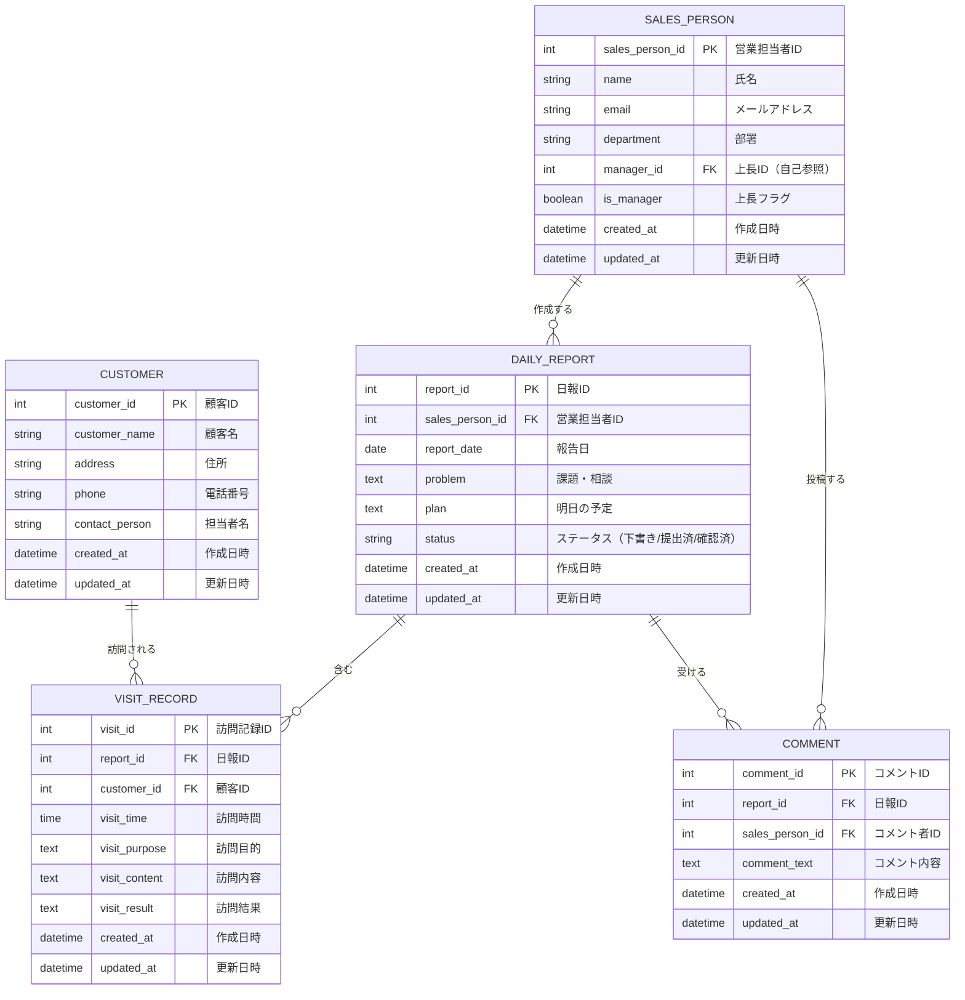

```mermaid
    erDiagram
        SALES_PERSON ||--o{ DAILY_REPORT : "作成する"
        SALES_PERSON ||--o{ COMMENT : "投稿する"
        DAILY_REPORT ||--o{ VISIT_RECORD : "含む"
        DAILY_REPORT ||--o{ COMMENT : "受ける"
        CUSTOMER ||--o{ VISIT_RECORD : "訪問される"

        SALES_PERSON {
            int sales_person_id PK "営業担当者ID"
            string name "氏名"
            string email "メールアドレス"
            string department "部署"
            int manager_id FK "上長ID（自己参照）"
            boolean is_manager "上長フラグ"
            datetime created_at "作成日時"
            datetime updated_at "更新日時"
        }

        CUSTOMER {
            int customer_id PK "顧客ID"
            string customer_name "顧客名"
            string address "住所"
            string phone "電話番号"
            string contact_person "担当者名"
            datetime created_at "作成日時"
            datetime updated_at "更新日時"
        }

        DAILY_REPORT {
            int report_id PK "日報ID"
            int sales_person_id FK "営業担当者ID"
            date report_date "報告日"
            text problem "課題・相談"
            text plan "明日の予定"
            string status "ステータス（下書き/提出済/確認済）"
            datetime created_at "作成日時"
            datetime updated_at "更新日時"
        }

        VISIT_RECORD {
            int visit_id PK "訪問記録ID"
            int report_id FK "日報ID"
            int customer_id FK "顧客ID"
            time visit_time "訪問時間"
            text visit_purpose "訪問目的"
            text visit_content "訪問内容"
            text visit_result "訪問結果"
            datetime created_at "作成日時"
            datetime updated_at "更新日時"
        }

        COMMENT {
            int comment_id PK "コメントID"
            int report_id FK "日報ID"
            int sales_person_id FK "コメント者ID"
            text comment_text "コメント内容"
            datetime created_at "作成日時"
            datetime updated_at "更新日時"
        }
```
