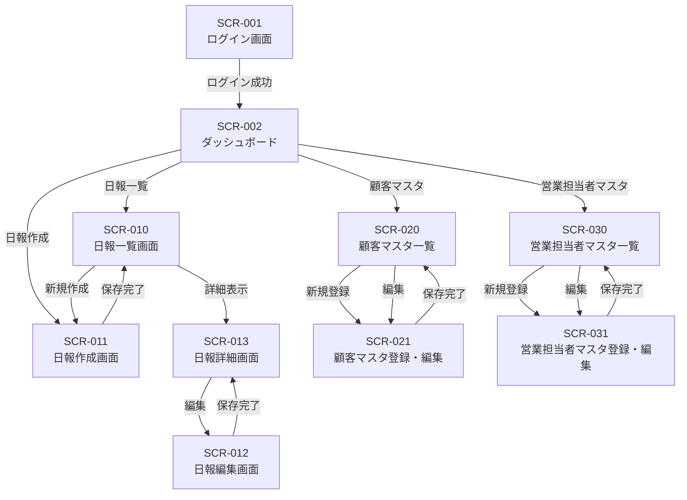

# 営業日報システム 画面定義書

## 目次

1. [画面一覧](#1-画面一覧)
2. [画面遷移図](#2-画面遷移図)
3. [各画面詳細](#3-各画面詳細)

---

## 1. 画面一覧

| No  | 画面ID  | 画面名                         | 概要                           | 主な利用者 |
| --- | ------- | ------------------------------ | ------------------------------ | ---------- |
| 1   | SCR-001 | ログイン画面                   | システムへのログイン           | 全ユーザー |
| 2   | SCR-002 | ダッシュボード                 | ホーム画面、日報一覧・通知表示 | 全ユーザー |
| 3   | SCR-010 | 日報一覧画面                   | 日報の検索・一覧表示           | 全ユーザー |
| 4   | SCR-011 | 日報作成画面                   | 新規日報の作成                 | 営業担当者 |
| 5   | SCR-012 | 日報編集画面                   | 既存日報の編集                 | 営業担当者 |
| 6   | SCR-013 | 日報詳細画面                   | 日報の詳細表示・コメント機能   | 全ユーザー |
| 7   | SCR-020 | 顧客マスタ一覧画面             | 顧客の検索・一覧表示           | 全ユーザー |
| 8   | SCR-021 | 顧客マスタ登録・編集画面       | 顧客情報の登録・編集           | 管理者     |
| 9   | SCR-030 | 営業担当者マスタ一覧画面       | 営業担当者の検索・一覧表示     | 管理者     |
| 10  | SCR-031 | 営業担当者マスタ登録・編集画面 | 営業担当者情報の登録・編集     | 管理者     |

---

## 2. 画面遷移図



---

## 3. 各画面詳細

---

### 3.1 SCR-001 ログイン画面

#### 基本情報

| 項目         | 内容                           |
| ------------ | ------------------------------ |
| 画面ID       | SCR-001                        |
| 画面名       | ログイン画面                   |
| 概要         | システムへのログイン認証を行う |
| アクセス権限 | なし（未認証ユーザー）         |

#### 画面レイアウト

```
┌─────────────────────────────────────────────────────────┐
│                    営業日報システム                        │
├─────────────────────────────────────────────────────────┤
│                                                         │
│              ┌─────────────────────────┐               │
│              │      ログイン           │               │
│              ├─────────────────────────┤               │
│              │ メールアドレス          │               │
│              │ [                     ] │               │
│              │                         │               │
│              │ パスワード              │               │
│              │ [                     ] │               │
│              │                         │               │
│              │    [  ログイン  ]       │               │
│              │                         │               │
│              │ □ ログイン状態を保持    │               │
│              └─────────────────────────┘               │
│                                                         │
└─────────────────────────────────────────────────────────┘
```

#### 画面項目一覧

| No  | 項目ID    | 項目名             | 種別             | 必須 | 備考               |
| --- | --------- | ------------------ | ---------------- | ---- | ------------------ |
| 1   | email     | メールアドレス     | テキスト入力     | ○    | メール形式チェック |
| 2   | password  | パスワード         | パスワード入力   | ○    | マスク表示         |
| 3   | remember  | ログイン状態を保持 | チェックボックス | -    | -                  |
| 4   | btn_login | ログインボタン     | ボタン           | -    | -                  |

#### イベント一覧

| No  | イベントID | トリガー           | 処理内容                                       |
| --- | ---------- | ------------------ | ---------------------------------------------- |
| 1   | EVT-001-01 | ログインボタン押下 | 認証処理を実行し、成功時はダッシュボードへ遷移 |

---

### 3.2 SCR-002 ダッシュボード

#### 基本情報

| 項目         | 内容                                           |
| ------------ | ---------------------------------------------- |
| 画面ID       | SCR-002                                        |
| 画面名       | ダッシュボード                                 |
| 概要         | ログイン後のホーム画面。最新の日報や通知を表示 |
| アクセス権限 | 全ユーザー                                     |

#### 画面レイアウト

```
┌─────────────────────────────────────────────────────────────────┐
│ [ロゴ]  日報一覧  顧客マスタ  営業マスタ      [ユーザー名 ▼]    │
├─────────────────────────────────────────────────────────────────┤
│                                                                 │
│  ようこそ、○○さん                      [+ 本日の日報を作成]    │
│                                                                 │
│  ┌─────────────────────────┐  ┌─────────────────────────┐     │
│  │ 今月の訪問件数          │  │ 未確認の日報            │     │
│  │        42 件           │  │        3 件            │     │
│  └─────────────────────────┘  └─────────────────────────┘     │
│                                                                 │
│  ┌─────────────────────────────────────────────────────────┐   │
│  │ 最近の日報                                               │   │
│  ├─────────────────────────────────────────────────────────┤   │
│  │ 2024/01/15  訪問3件  ステータス：確認済  [詳細]          │   │
│  │ 2024/01/14  訪問2件  ステータス：提出済  [詳細]          │   │
│  │ 2024/01/13  訪問4件  ステータス：確認済  [詳細]          │   │
│  └─────────────────────────────────────────────────────────┘   │
│                                                                 │
│  ┌─────────────────────────────────────────────────────────┐   │
│  │ 新着コメント                                             │   │
│  ├─────────────────────────────────────────────────────────┤   │
│  │ [上長名] が 2024/01/14 の日報にコメントしました          │   │
│  │ 「明日の商談、頑張ってください！」                        │   │
│  └─────────────────────────────────────────────────────────┘   │
│                                                                 │
└─────────────────────────────────────────────────────────────────┘
```

#### 画面項目一覧

| No  | 項目ID            | 項目名           | 種別   | 備考                               |
| --- | ----------------- | ---------------- | ------ | ---------------------------------- |
| 1   | visit_count       | 今月の訪問件数   | 表示   | 当月の訪問記録件数を集計           |
| 2   | unconfirmed_count | 未確認の日報     | 表示   | 上長のみ表示、部下の未確認日報件数 |
| 3   | recent_reports    | 最近の日報       | リスト | 直近5件の日報を表示                |
| 4   | recent_comments   | 新着コメント     | リスト | 直近のコメント通知を表示           |
| 5   | btn_create        | 本日の日報を作成 | ボタン | 日報作成画面へ遷移                 |

---

### 3.3 SCR-010 日報一覧画面

#### 基本情報

| 項目         | 内容                                                               |
| ------------ | ------------------------------------------------------------------ |
| 画面ID       | SCR-010                                                            |
| 画面名       | 日報一覧画面                                                       |
| 概要         | 日報の検索・一覧表示を行う                                         |
| アクセス権限 | 全ユーザー（営業担当者は自分の日報のみ、上長は部下の日報も閲覧可） |

#### 画面レイアウト

```
┌─────────────────────────────────────────────────────────────────┐
│ [ロゴ]  日報一覧  顧客マスタ  営業マスタ      [ユーザー名 ▼]    │
├─────────────────────────────────────────────────────────────────┤
│                                                                 │
│  日報一覧                                    [+ 新規作成]       │
│                                                                 │
│  ┌─────────────────────────────────────────────────────────┐   │
│  │ 検索条件                                                 │   │
│  │ 期間: [2024/01/01] ～ [2024/01/31]                       │   │
│  │ 担当者: [全て         ▼]  ステータス: [全て      ▼]     │   │
│  │                                         [検索] [クリア]  │   │
│  └─────────────────────────────────────────────────────────┘   │
│                                                                 │
│  検索結果: 25件                                                 │
│  ┌────┬────────────┬──────────┬────────┬──────────┬──────┐   │
│  │ No │ 報告日     │ 担当者   │訪問件数│ステータス│ 操作 │   │
│  ├────┼────────────┼──────────┼────────┼──────────┼──────┤   │
│  │ 1  │ 2024/01/15 │ 山田太郎 │  3件   │ 確認済   │[詳細]│   │
│  │ 2  │ 2024/01/14 │ 山田太郎 │  2件   │ 提出済   │[詳細]│   │
│  │ 3  │ 2024/01/13 │ 山田太郎 │  4件   │ 確認済   │[詳細]│   │
│  │ .. │ ...        │ ...      │  ...   │ ...      │ ...  │   │
│  └────┴────────────┴──────────┴────────┴──────────┴──────┘   │
│                                                                 │
│  [<前へ]  1 / 5  [次へ>]                                       │
│                                                                 │
└─────────────────────────────────────────────────────────────────┘
```

#### 画面項目一覧

| No  | 項目ID       | 項目名         | 種別       | 備考                      |
| --- | ------------ | -------------- | ---------- | ------------------------- |
| 1   | date_from    | 期間（開始）   | 日付入力   | カレンダーピッカー        |
| 2   | date_to      | 期間（終了）   | 日付入力   | カレンダーピッカー        |
| 3   | sales_person | 担当者         | プルダウン | 上長のみ部下を選択可能    |
| 4   | status       | ステータス     | プルダウン | 全て/下書き/提出済/確認済 |
| 5   | btn_search   | 検索ボタン     | ボタン     | -                         |
| 6   | btn_clear    | クリアボタン   | ボタン     | 検索条件をリセット        |
| 7   | report_list  | 日報一覧       | テーブル   | ソート可能                |
| 8   | btn_create   | 新規作成ボタン | ボタン     | 日報作成画面へ遷移        |

#### イベント一覧

| No  | イベントID | トリガー           | 処理内容                       |
| --- | ---------- | ------------------ | ------------------------------ |
| 1   | EVT-010-01 | 検索ボタン押下     | 検索条件で日報を検索し一覧表示 |
| 2   | EVT-010-02 | 詳細ボタン押下     | 日報詳細画面へ遷移             |
| 3   | EVT-010-03 | 新規作成ボタン押下 | 日報作成画面へ遷移             |

---

### 3.4 SCR-011 日報作成画面

#### 基本情報

| 項目         | 内容                 |
| ------------ | -------------------- |
| 画面ID       | SCR-011              |
| 画面名       | 日報作成画面         |
| 概要         | 新規日報の作成を行う |
| アクセス権限 | 営業担当者           |

#### 画面レイアウト

```
┌─────────────────────────────────────────────────────────────────┐
│ [ロゴ]  日報一覧  顧客マスタ  営業マスタ      [ユーザー名 ▼]    │
├─────────────────────────────────────────────────────────────────┤
│                                                                 │
│  日報作成                                                       │
│                                                                 │
│  報告日: [2024/01/15  ▼]                                       │
│                                                                 │
│  ━━━━━━━━━━━━━━━━━━━━━━━━━━━━━━━━━━━━━━━━━━━━━━━━━━━━━━━━━━━   │
│  訪問記録                                       [+ 訪問を追加]  │
│  ━━━━━━━━━━━━━━━━━━━━━━━━━━━━━━━━━━━━━━━━━━━━━━━━━━━━━━━━━━━   │
│                                                                 │
│  ┌─────────────────────────────────────────────────────────┐   │
│  │ 訪問 1                                            [×]   │   │
│  │ 顧客名: [株式会社ABC                        ▼]          │   │
│  │ 訪問時間: [10:00]                                        │   │
│  │ 訪問目的: [                                    ]         │   │
│  │ 訪問内容:                                                │   │
│  │ [                                                      ] │   │
│  │ [                                                      ] │   │
│  │ 訪問結果: [                                    ]         │   │
│  └─────────────────────────────────────────────────────────┘   │
│                                                                 │
│  ┌─────────────────────────────────────────────────────────┐   │
│  │ 訪問 2                                            [×]   │   │
│  │ 顧客名: [株式会社XYZ                        ▼]          │   │
│  │ ...                                                      │   │
│  └─────────────────────────────────────────────────────────┘   │
│                                                                 │
│  ━━━━━━━━━━━━━━━━━━━━━━━━━━━━━━━━━━━━━━━━━━━━━━━━━━━━━━━━━━━   │
│  課題・相談（Problem）                                          │
│  ━━━━━━━━━━━━━━━━━━━━━━━━━━━━━━━━━━━━━━━━━━━━━━━━━━━━━━━━━━━   │
│  [                                                            ] │
│  [                                                            ] │
│  [                                                            ] │
│                                                                 │
│  ━━━━━━━━━━━━━━━━━━━━━━━━━━━━━━━━━━━━━━━━━━━━━━━━━━━━━━━━━━━   │
│  明日の予定（Plan）                                             │
│  ━━━━━━━━━━━━━━━━━━━━━━━━━━━━━━━━━━━━━━━━━━━━━━━━━━━━━━━━━━━   │
│  [                                                            ] │
│  [                                                            ] │
│  [                                                            ] │
│                                                                 │
│            [下書き保存]    [提出]    [キャンセル]               │
│                                                                 │
└─────────────────────────────────────────────────────────────────┘
```

#### 画面項目一覧

| No  | 項目ID        | 項目名         | 種別           | 必須 | 備考                       |
| --- | ------------- | -------------- | -------------- | ---- | -------------------------- |
| 1   | report_date   | 報告日         | 日付入力       | ○    | デフォルト：当日           |
| 2   | visits        | 訪問記録エリア | 繰り返し       | -    | 動的に追加・削除可能       |
| 2-1 | customer_id   | 顧客名         | プルダウン     | ○    | 顧客マスタから選択         |
| 2-2 | visit_time    | 訪問時間       | 時間入力       | -    | HH:MM形式                  |
| 2-3 | visit_purpose | 訪問目的       | テキスト入力   | -    | 最大100文字                |
| 2-4 | visit_content | 訪問内容       | テキストエリア | ○    | 最大1000文字               |
| 2-5 | visit_result  | 訪問結果       | テキスト入力   | -    | 最大200文字                |
| 3   | problem       | 課題・相談     | テキストエリア | -    | 最大2000文字               |
| 4   | plan          | 明日の予定     | テキストエリア | -    | 最大2000文字               |
| 5   | btn_add_visit | 訪問を追加     | ボタン         | -    | 訪問記録を追加             |
| 6   | btn_draft     | 下書き保存     | ボタン         | -    | ステータス「下書き」で保存 |
| 7   | btn_submit    | 提出           | ボタン         | -    | ステータス「提出済」で保存 |
| 8   | btn_cancel    | キャンセル     | ボタン         | -    | 一覧画面へ戻る             |

#### イベント一覧

| No  | イベントID | トリガー             | 処理内容                                   |
| --- | ---------- | -------------------- | ------------------------------------------ |
| 1   | EVT-011-01 | 訪問を追加ボタン押下 | 訪問記録入力エリアを追加                   |
| 2   | EVT-011-02 | ×ボタン押下          | 対象の訪問記録を削除（確認ダイアログ表示） |
| 3   | EVT-011-03 | 下書き保存ボタン押下 | バリデーション後、下書きとして保存         |
| 4   | EVT-011-04 | 提出ボタン押下       | バリデーション後、提出済として保存         |
| 5   | EVT-011-05 | キャンセルボタン押下 | 確認ダイアログ後、一覧画面へ遷移           |

#### バリデーション

| No  | 項目     | チェック内容              | エラーメッセージ                  |
| --- | -------- | ------------------------- | --------------------------------- |
| 1   | 報告日   | 必須チェック              | 報告日を入力してください          |
| 2   | 報告日   | 未来日チェック            | 未来の日付は指定できません        |
| 3   | 顧客名   | 必須チェック              | 顧客を選択してください            |
| 4   | 訪問内容 | 必須チェック              | 訪問内容を入力してください        |
| 5   | 訪問記録 | 最低1件チェック（提出時） | 訪問記録を1件以上入力してください |

---

### 3.5 SCR-012 日報編集画面

#### 基本情報

| 項目         | 内容                                                   |
| ------------ | ------------------------------------------------------ |
| 画面ID       | SCR-012                                                |
| 画面名       | 日報編集画面                                           |
| 概要         | 既存日報の編集を行う                                   |
| アクセス権限 | 営業担当者（自分の日報のみ、下書き・提出済のみ編集可） |

#### 画面レイアウト

SCR-011（日報作成画面）と同様。ただし以下の点が異なる：

- タイトルが「日報編集」
- 既存データが初期表示される
- 「確認済」ステータスの日報は編集不可

#### 画面項目一覧

SCR-011と同様

---

### 3.6 SCR-013 日報詳細画面

#### 基本情報

| 項目         | 内容                                 |
| ------------ | ------------------------------------ |
| 画面ID       | SCR-013                              |
| 画面名       | 日報詳細画面                         |
| 概要         | 日報の詳細表示とコメント機能         |
| アクセス権限 | 全ユーザー（閲覧権限のある日報のみ） |

#### 画面レイアウト

```
┌─────────────────────────────────────────────────────────────────┐
│ [ロゴ]  日報一覧  顧客マスタ  営業マスタ      [ユーザー名 ▼]    │
├─────────────────────────────────────────────────────────────────┤
│                                                                 │
│  日報詳細                    [編集] [確認済にする] [一覧へ戻る] │
│                                                                 │
│  ┌─────────────────────────────────────────────────────────┐   │
│  │ 基本情報                                                 │   │
│  │ 報告日：2024年1月15日（月）                              │   │
│  │ 担当者：山田太郎                                         │   │
│  │ ステータス：提出済                                       │   │
│  └─────────────────────────────────────────────────────────┘   │
│                                                                 │
│  ┌─────────────────────────────────────────────────────────┐   │
│  │ 訪問記録                                                 │   │
│  ├─────────────────────────────────────────────────────────┤   │
│  │ ■ 訪問 1                                                │   │
│  │   顧客名：株式会社ABC                                    │   │
│  │   訪問時間：10:00                                        │   │
│  │   訪問目的：新製品のご提案                               │   │
│  │   訪問内容：新製品Xについて説明。担当者の佐藤様は        │   │
│  │            興味を示され、次回デモの約束を取り付けた。    │   │
│  │   訪問結果：次回デモ日程調整中                           │   │
│  │ ─────────────────────────────────────────────────────── │   │
│  │ ■ 訪問 2                                                │   │
│  │   顧客名：株式会社XYZ                                    │   │
│  │   ...                                                    │   │
│  └─────────────────────────────────────────────────────────┘   │
│                                                                 │
│  ┌─────────────────────────────────────────────────────────┐   │
│  │ 課題・相談（Problem）                                    │   │
│  ├─────────────────────────────────────────────────────────┤   │
│  │ ・競合他社の価格が当社より10%安いため、価格交渉が       │   │
│  │   難航している。                                         │   │
│  │ ・来週の展示会の準備が間に合うか心配。                   │   │
│  └─────────────────────────────────────────────────────────┘   │
│                                                                 │
│  ┌─────────────────────────────────────────────────────────┐   │
│  │ 明日の予定（Plan）                                       │   │
│  ├─────────────────────────────────────────────────────────┤   │
│  │ ・午前：株式会社DEFへ訪問（見積提出）                    │   │
│  │ ・午後：展示会資料の最終確認                             │   │
│  └─────────────────────────────────────────────────────────┘   │
│                                                                 │
│  ┌─────────────────────────────────────────────────────────┐   │
│  │ コメント                                                 │   │
│  ├─────────────────────────────────────────────────────────┤   │
│  │ 鈴木課長  2024/01/15 18:30                              │   │
│  │ 競合の件、一度価格戦略会議で相談しましょう。            │   │
│  │ 展示会は私もサポートするので心配しないでください。      │   │
│  │ ─────────────────────────────────────────────────────── │   │
│  │ [コメントを入力...                                     ] │   │
│  │                                           [コメント送信] │   │
│  └─────────────────────────────────────────────────────────┘   │
│                                                                 │
└─────────────────────────────────────────────────────────────────┘
```

#### 画面項目一覧

| No  | 項目ID            | 項目名             | 種別           | 備考                     |
| --- | ----------------- | ------------------ | -------------- | ------------------------ |
| 1   | report_date       | 報告日             | 表示           | -                        |
| 2   | sales_person_name | 担当者             | 表示           | -                        |
| 3   | status            | ステータス         | 表示           | バッジ表示               |
| 4   | visits            | 訪問記録           | 表示           | -                        |
| 5   | problem           | 課題・相談         | 表示           | -                        |
| 6   | plan              | 明日の予定         | 表示           | -                        |
| 7   | comments          | コメント一覧       | 表示           | 時系列順                 |
| 8   | comment_input     | コメント入力       | テキストエリア | 最大500文字              |
| 9   | btn_edit          | 編集ボタン         | ボタン         | 本人かつ未確認時のみ表示 |
| 10  | btn_confirm       | 確認済にするボタン | ボタン         | 上長かつ提出済時のみ表示 |
| 11  | btn_comment       | コメント送信ボタン | ボタン         | 上長のみ表示             |
| 12  | btn_back          | 一覧へ戻るボタン   | ボタン         | -                        |

#### イベント一覧

| No  | イベントID | トリガー               | 処理内容                     |
| --- | ---------- | ---------------------- | ---------------------------- |
| 1   | EVT-013-01 | 編集ボタン押下         | 日報編集画面へ遷移           |
| 2   | EVT-013-02 | 確認済にするボタン押下 | ステータスを「確認済」に更新 |
| 3   | EVT-013-03 | コメント送信ボタン押下 | コメントを登録し、一覧を更新 |

---

### 3.7 SCR-020 顧客マスタ一覧画面

#### 基本情報

| 項目         | 内容                                     |
| ------------ | ---------------------------------------- |
| 画面ID       | SCR-020                                  |
| 画面名       | 顧客マスタ一覧画面                       |
| 概要         | 顧客情報の検索・一覧表示                 |
| アクセス権限 | 全ユーザー（閲覧）、管理者（編集・削除） |

#### 画面レイアウト

```
┌─────────────────────────────────────────────────────────────────┐
│ [ロゴ]  日報一覧  顧客マスタ  営業マスタ      [ユーザー名 ▼]    │
├─────────────────────────────────────────────────────────────────┤
│                                                                 │
│  顧客マスタ                                  [+ 新規登録]       │
│                                                                 │
│  ┌─────────────────────────────────────────────────────────┐   │
│  │ 検索条件                                                 │   │
│  │ 顧客名: [                    ]                           │   │
│  │                                         [検索] [クリア]  │   │
│  └─────────────────────────────────────────────────────────┘   │
│                                                                 │
│  検索結果: 50件                                                 │
│  ┌────┬──────────────┬────────────────┬──────────┬──────┐     │
│  │ No │ 顧客名       │ 住所           │ 担当者名 │ 操作 │     │
│  ├────┼──────────────┼────────────────┼──────────┼──────┤     │
│  │ 1  │ 株式会社ABC  │ 東京都港区...  │ 佐藤一郎 │[編集]│     │
│  │ 2  │ 株式会社XYZ  │ 大阪府大阪市...│ 田中花子 │[編集]│     │
│  │ .. │ ...          │ ...            │ ...      │ ...  │     │
│  └────┴──────────────┴────────────────┴──────────┴──────┘     │
│                                                                 │
│  [<前へ]  1 / 5  [次へ>]                                       │
│                                                                 │
└─────────────────────────────────────────────────────────────────┘
```

#### 画面項目一覧

| No  | 項目ID        | 項目名         | 種別         | 備考           |
| --- | ------------- | -------------- | ------------ | -------------- |
| 1   | customer_name | 顧客名         | テキスト入力 | 部分一致検索   |
| 2   | btn_search    | 検索ボタン     | ボタン       | -              |
| 3   | btn_clear     | クリアボタン   | ボタン       | -              |
| 4   | customer_list | 顧客一覧       | テーブル     | ソート可能     |
| 5   | btn_create    | 新規登録ボタン | ボタン       | 管理者のみ表示 |
| 6   | btn_edit      | 編集ボタン     | ボタン       | 管理者のみ表示 |

---

### 3.8 SCR-021 顧客マスタ登録・編集画面

#### 基本情報

| 項目         | 内容                     |
| ------------ | ------------------------ |
| 画面ID       | SCR-021                  |
| 画面名       | 顧客マスタ登録・編集画面 |
| 概要         | 顧客情報の登録・編集     |
| アクセス権限 | 管理者                   |

#### 画面レイアウト

```
┌─────────────────────────────────────────────────────────────────┐
│ [ロゴ]  日報一覧  顧客マスタ  営業マスタ      [ユーザー名 ▼]    │
├─────────────────────────────────────────────────────────────────┤
│                                                                 │
│  顧客マスタ 登録 / 編集                                         │
│                                                                 │
│  ┌─────────────────────────────────────────────────────────┐   │
│  │ 顧客名 *                                                 │   │
│  │ [                                                      ] │   │
│  │                                                         │   │
│  │ 住所                                                     │   │
│  │ [                                                      ] │   │
│  │                                                         │   │
│  │ 電話番号                                                 │   │
│  │ [                                                      ] │   │
│  │                                                         │   │
│  │ 担当者名                                                 │   │
│  │ [                                                      ] │   │
│  │                                                         │   │
│  └─────────────────────────────────────────────────────────┘   │
│                                                                 │
│                    [保存]    [キャンセル]    [削除]             │
│                                                                 │
└─────────────────────────────────────────────────────────────────┘
```

#### 画面項目一覧

| No  | 項目ID         | 項目名           | 種別         | 必須 | 備考                 |
| --- | -------------- | ---------------- | ------------ | ---- | -------------------- |
| 1   | customer_name  | 顧客名           | テキスト入力 | ○    | 最大100文字          |
| 2   | address        | 住所             | テキスト入力 | -    | 最大200文字          |
| 3   | phone          | 電話番号         | テキスト入力 | -    | 電話番号形式チェック |
| 4   | contact_person | 担当者名         | テキスト入力 | -    | 最大50文字           |
| 5   | btn_save       | 保存ボタン       | ボタン       | -    | -                    |
| 6   | btn_cancel     | キャンセルボタン | ボタン       | -    | -                    |
| 7   | btn_delete     | 削除ボタン       | ボタン       | -    | 編集時のみ表示       |

#### バリデーション

| No  | 項目     | チェック内容 | エラーメッセージ                     |
| --- | -------- | ------------ | ------------------------------------ |
| 1   | 顧客名   | 必須チェック | 顧客名を入力してください             |
| 2   | 顧客名   | 重複チェック | この顧客名は既に登録されています     |
| 3   | 電話番号 | 形式チェック | 正しい電話番号形式で入力してください |

---

### 3.9 SCR-030 営業担当者マスタ一覧画面

#### 基本情報

| 項目         | 内容                           |
| ------------ | ------------------------------ |
| 画面ID       | SCR-030                        |
| 画面名       | 営業担当者マスタ一覧画面       |
| 概要         | 営業担当者情報の検索・一覧表示 |
| アクセス権限 | 管理者                         |

#### 画面レイアウト

```
┌─────────────────────────────────────────────────────────────────┐
│ [ロゴ]  日報一覧  顧客マスタ  営業マスタ      [ユーザー名 ▼]    │
├─────────────────────────────────────────────────────────────────┤
│                                                                 │
│  営業担当者マスタ                            [+ 新規登録]       │
│                                                                 │
│  ┌─────────────────────────────────────────────────────────┐   │
│  │ 検索条件                                                 │   │
│  │ 氏名: [            ]  部署: [全て         ▼]            │   │
│  │                                         [検索] [クリア]  │   │
│  └─────────────────────────────────────────────────────────┘   │
│                                                                 │
│  検索結果: 20件                                                 │
│  ┌────┬──────────┬──────────┬──────────┬────────┬──────┐     │
│  │ No │ 氏名     │ 部署     │ 上長     │ 権限   │ 操作 │     │
│  ├────┼──────────┼──────────┼──────────┼────────┼──────┤     │
│  │ 1  │ 山田太郎 │ 営業1課  │ 鈴木課長 │ 一般   │[編集]│     │
│  │ 2  │ 鈴木一郎 │ 営業1課  │ -        │ 上長   │[編集]│     │
│  │ .. │ ...      │ ...      │ ...      │ ...    │ ...  │     │
│  └────┴──────────┴──────────┴──────────┴────────┴──────┘     │
│                                                                 │
│  [<前へ]  1 / 2  [次へ>]                                       │
│                                                                 │
└─────────────────────────────────────────────────────────────────┘
```

#### 画面項目一覧

| No  | 項目ID            | 項目名         | 種別         | 備考         |
| --- | ----------------- | -------------- | ------------ | ------------ |
| 1   | name              | 氏名           | テキスト入力 | 部分一致検索 |
| 2   | department        | 部署           | プルダウン   | -            |
| 3   | btn_search        | 検索ボタン     | ボタン       | -            |
| 4   | btn_clear         | クリアボタン   | ボタン       | -            |
| 5   | sales_person_list | 営業担当者一覧 | テーブル     | ソート可能   |
| 6   | btn_create        | 新規登録ボタン | ボタン       | -            |
| 7   | btn_edit          | 編集ボタン     | ボタン       | -            |

---

### 3.10 SCR-031 営業担当者マスタ登録・編集画面

#### 基本情報

| 項目         | 内容                           |
| ------------ | ------------------------------ |
| 画面ID       | SCR-031                        |
| 画面名       | 営業担当者マスタ登録・編集画面 |
| 概要         | 営業担当者情報の登録・編集     |
| アクセス権限 | 管理者                         |

#### 画面レイアウト

```
┌─────────────────────────────────────────────────────────────────┐
│ [ロゴ]  日報一覧  顧客マスタ  営業マスタ      [ユーザー名 ▼]    │
├─────────────────────────────────────────────────────────────────┤
│                                                                 │
│  営業担当者マスタ 登録 / 編集                                   │
│                                                                 │
│  ┌─────────────────────────────────────────────────────────┐   │
│  │ 氏名 *                                                   │   │
│  │ [                                                      ] │   │
│  │                                                         │   │
│  │ メールアドレス *                                         │   │
│  │ [                                                      ] │   │
│  │                                                         │   │
│  │ パスワード *（新規登録時のみ必須）                       │   │
│  │ [                                                      ] │   │
│  │                                                         │   │
│  │ 部署 *                                                   │   │
│  │ [営業1課                                           ▼]   │   │
│  │                                                         │   │
│  │ 上長                                                     │   │
│  │ [鈴木一郎                                          ▼]   │   │
│  │                                                         │   │
│  │ 権限                                                     │   │
│  │ ○ 一般  ○ 上長  ○ 管理者                              │   │
│  │                                                         │   │
│  └─────────────────────────────────────────────────────────┘   │
│                                                                 │
│                    [保存]    [キャンセル]    [削除]             │
│                                                                 │
└─────────────────────────────────────────────────────────────────┘
```

#### 画面項目一覧

| No  | 項目ID     | 項目名           | 種別           | 必須 | 備考                             |
| --- | ---------- | ---------------- | -------------- | ---- | -------------------------------- |
| 1   | name       | 氏名             | テキスト入力   | ○    | 最大50文字                       |
| 2   | email      | メールアドレス   | テキスト入力   | ○    | メール形式チェック               |
| 3   | password   | パスワード       | パスワード入力 | △    | 新規時必須、8文字以上            |
| 4   | department | 部署             | プルダウン     | ○    | -                                |
| 5   | manager_id | 上長             | プルダウン     | -    | 上長フラグがONのユーザーから選択 |
| 6   | is_manager | 権限             | ラジオボタン   | ○    | 一般/上長/管理者                 |
| 7   | btn_save   | 保存ボタン       | ボタン         | -    | -                                |
| 8   | btn_cancel | キャンセルボタン | ボタン         | -    | -                                |
| 9   | btn_delete | 削除ボタン       | ボタン         | -    | 編集時のみ表示                   |

#### バリデーション

| No  | 項目           | チェック内容         | エラーメッセージ                           |
| --- | -------------- | -------------------- | ------------------------------------------ |
| 1   | 氏名           | 必須チェック         | 氏名を入力してください                     |
| 2   | メールアドレス | 必須チェック         | メールアドレスを入力してください           |
| 3   | メールアドレス | 形式チェック         | 正しいメールアドレス形式で入力してください |
| 4   | メールアドレス | 重複チェック         | このメールアドレスは既に登録されています   |
| 5   | パスワード     | 必須チェック（新規） | パスワードを入力してください               |
| 6   | パスワード     | 文字数チェック       | パスワードは8文字以上で入力してください    |
| 7   | 部署           | 必須チェック         | 部署を選択してください                     |

---

## 4. 共通コンポーネント

### 4.1 ヘッダー

全画面共通で使用するグローバルナビゲーション。

| 項目             | 内容                                                   |
| ---------------- | ------------------------------------------------------ |
| ロゴ             | クリックでダッシュボードへ遷移                         |
| メニュー         | 日報一覧、顧客マスタ、営業マスタ（権限により表示制御） |
| ユーザーメニュー | プロフィール、パスワード変更、ログアウト               |

### 4.2 ページネーション

一覧画面で使用するページ送りコンポーネント。

| 項目       | 内容                           |
| ---------- | ------------------------------ |
| 表示件数   | 10件/20件/50件から選択可能     |
| ページ移動 | 前へ、次へ、ページ番号直接指定 |

### 4.3 確認ダイアログ

削除や画面遷移時の確認に使用。

```
┌─────────────────────────────────┐
│ 確認                           │
├─────────────────────────────────┤
│                                 │
│ 本当に削除してもよろしいですか？│
│                                 │
│       [キャンセル]  [削除]      │
└─────────────────────────────────┘
```

### 4.4 エラーメッセージ表示

バリデーションエラー時の表示形式。

- 画面上部にサマリーメッセージ（赤背景）
- 各入力項目の下に個別エラーメッセージ（赤文字）
- エラー項目は入力欄を赤枠で囲む

---

## 5. 改訂履歴

| 版  | 日付       | 内容     | 担当 |
| --- | ---------- | -------- | ---- |
| 1.0 | 2024/01/15 | 初版作成 | -    |
